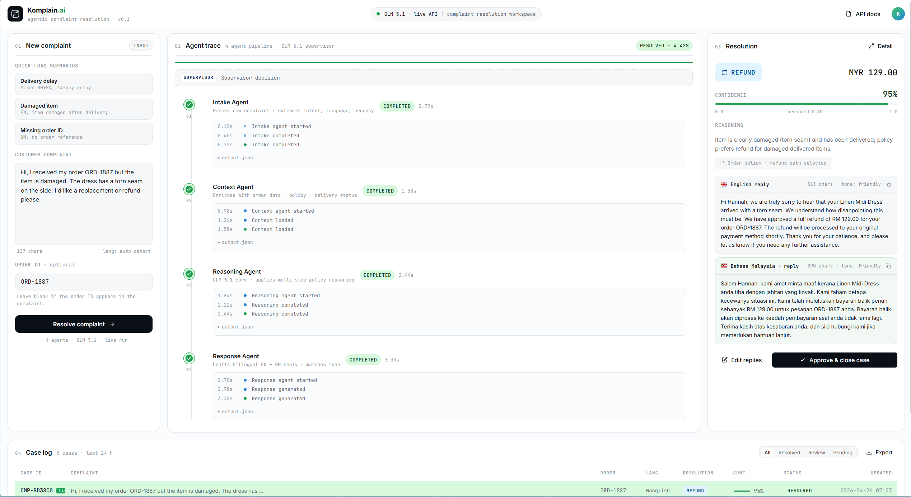

<div align="center">

# Komplain.ai

[](https://github.com/Mohmed/KomplainTest/actions/workflows/ci.yml)


### Agentic Customer Complaint Resolution — powered by Groq

*From a raw, code-switched complaint to an approved bilingual resolution in under 45 seconds.*

[](https://komplain-ai.netlify.app)
[](https://komplain-ai.onrender.com/api/health)
[](https://www.python.org/)
[](https://fastapi.tiangolo.com/)
[](https://react.dev/)
[](https://groq.com/)

**Hackathon Track:** AI Systems & Agentic Workflow Automation

</div>

---

## Pitch Video & Live Demonstration (10 minutes)

> ### **[Watch the recorded pitch + product demo](https://drive.google.com/file/d/1IJ3Xe-SRWEcsv7_5ecS_KsFvllmv88rM/view?usp=sharing)**
>


---

## Try It Right Now

You have **two ways** to experience Komplain.ai. Pick whichever you prefer.

### Option 1 — Live Web App (easiest, zero setup)

The frontend is already deployed on Netlify and the backend on Render. Just open the link:

> ### **[komplain-ai.netlify.app](https://beamish-meringue-c0dd31.netlify.app/komplain.ai%20dashboard?v=20260425-frontend-refresh)**

Drop in a complaint (or use a quick-load scenario) and watch the full 5-agent pipeline run in your browser.

> Note: the first request after a long idle period may take ~30 seconds. Render's free tier cold-starts the backend.

### Option 2 — Run Locally

For full control and fast iteration. See the [Run Locally](#run-locally) section below.

```bash
git clone https://github.com/Ph0enix19/Komplain.ai.git
cd Komplain.ai
# then follow the local setup steps in the section below
```

You will need: Python 3.13, a Groq API key, and a browser.

---

## Live Demo Preview



*The Komplain.ai dashboard: complaint intake, live agent trace, bilingual resolution card, and the recent case log.*

> _If the image above is not displaying, drop your screenshot at `docs/screenshots/dashboard.png` and commit it._

---

## Submission Deliverables

All deliverables required by the hackathon rubric are in this repository, in **PDF format**, with editable sources committed alongside.

| # | Deliverable | PDF | Source |
|---|---|---|---|
| 1 | **PRD** — Product Requirements Document | [docs/PRD.pdf](./docs/PRD.pdf) | — |
| 2 | **SAD** — System Architecture Document | [docs/SAD.pdf](./docs/SAD.pdf) | — |
| 3 | **QATD** — Quality Assurance & Testing Document | [docs/QATD.pdf](./docs/QATD.pdf) | [docs/QATD.docx](./docs/QATD.docx) |
| 4 | **Pitch Deck** | [docs/PitchDeck.pdf](./docs/PitchDeck.pdf) | [docs/PitchDeck.pptx](./docs/PitchDeck.pptx) |
| 5 | **Pitch Script** (speaker notes for the video) | [docs/PitchScript.md](./docs/PitchScript.md) | — |
| 6 | **Pitch Video (10 min + demo)** | _link at top of this README_ | — |
| 7 | **Source Code** | _this repository_ | — |

---

## What Komplain.ai Does

Komplain.ai is an **AI copilot for e-commerce support teams**. It turns raw, unstructured customer complaints — often written in **Manglish** (mixed English + Bahasa Malaysia) — into structured, auditable, bilingual support outcomes, while keeping a human supervisor in the loop for the final approval.

A support operator can:

1. Submit a complaint (with or without an order ID)
2. Watch each agent step run in a live trace with real latency and token telemetry
3. Review the final recommendation, confidence score, policy rationale, total latency, token count, and estimated cost
4. Copy or edit the bilingual customer reply and click Approve
5. Start the next complaint from a cleared workspace with no stale trace or resolution data
6. Audit any past case from the case log

The backend persists only the latest five complaints and their event logs — focused MVP scope, designed to scale into PostgreSQL and multi-tenant SaaS post-hackathon.

---

## How It Works — 5-Agent Pipeline

| # | Agent | Role | Engine |
|---|---|---|---|
| 1 | **Intake** | Extracts order ID, complaint type, language, sentiment from raw text | Groq |
| 2 | **Context** | Looks up the order; synthesises a contextual note | Rule + Groq |
| 3 | **Reasoning** | Evaluates complaint + policy → REFUND / RESHIP / ESCALATE / DISMISS | Groq |
| 4 | **Response** | Drafts bilingual EN + BM customer reply aligned to the decision | Groq |
| 5 | **Supervisor** | Independent validation, confidence flag, escalation priority | Groq |

> **Human-in-the-Loop:** Every AI-generated resolution requires explicit supervisor approval before any reply is dispatched.

### Pipeline Telemetry

Each complaint run records operational telemetry for the full agent pipeline:

- Per-agent latency is measured with `time.time()` and rounded to 2 decimal places.
- Agent event logs include `duration`, `input_tokens`, and `output_tokens`.
- The final complaint record includes aggregate `total_latency`, `total_tokens`, and `estimated_cost_rm`.
- Token usage is read from the provider response when available. If the provider does not return usage, Komplain.ai estimates tokens with a simple word-count heuristic.
- Estimated cost uses `COST_PER_1K_TOKENS_RM = 0.002`, so `estimated_cost_rm = (total_tokens / 1000) * COST_PER_1K_TOKENS_RM`.

These telemetry fields are returned by `/api/complaints`, available in persisted complaint records, and surfaced in the frontend agent trace, case detail view, command center, and resolution card.

For the full architectural rationale, agent prompts, validation strategy, and roadmap, see **[docs/SAD.pdf](./docs/SAD.pdf)**.

---

## Tech Stack

- **Frontend:** React 18 (UMD + Babel Standalone, no build step), plain CSS, static site on Netlify
- **Backend:** FastAPI, Uvicorn, Pydantic v2, Python 3.13, hosted on Render
- **LLM Engine:** Groq OpenAI-compatible API, JSON mode, key-value fallback, typed validation
- **Storage:** JSON flat-file (MVP); PostgreSQL migration path documented in the SAD

---

## Run Locally

### Prerequisites

- Python 3.13+
- A [Groq](https://console.groq.com/keys) API key
- A modern browser

### 1. Clone and set up the virtual environment

```bash
git clone https://github.com/Ph0enix19/Komplain.ai.git
cd Komplain.ai
python -m venv .venv

# macOS / Linux
source .venv/bin/activate

# Windows PowerShell
.\.venv\Scripts\Activate.ps1
```

### 2. Install backend dependencies

```bash
pip install -r backend/requirements.txt
```

For local testing and CI parity, also install the dev tools:

```bash
pip install -r requirements-dev.txt
```

### 3. Create your .env file in the repo root

```env
LLM_PROVIDER=groq
GROQ_API_KEY=your_api_key_here
GROQ_BASE_URL=https://api.groq.com/openai/v1
GROQ_MODEL=llama-3.1-8b-instant
GROQ_TIMEOUT=180
AGENT_LLM_TIMEOUT_SECONDS=180
```

### 4. Start the backend (port 8000)

```bash
python -m uvicorn backend.main:app --host 127.0.0.1 --port 8000
```

API docs auto-generate at <http://127.0.0.1:8000/docs>.

### 5. Start the frontend (port 3000) from the /frontend directory

```bash
cd frontend
python -m http.server 3000 --bind 127.0.0.1
```

### 6. Open the dashboard

```
http://127.0.0.1:3000/
```

> Note: when running locally, the frontend defaults to the deployed Render backend. To point it at your local backend, edit `API_BASE` in `frontend/data.js`.

---

## Deployment

### Frontend on Netlify

[`netlify.toml`](./netlify.toml) publishes the `/frontend` directory with no build command — pure static hosting.

| Setting | Value |
|---|---|
| Base directory | _empty_ |
| Build command | _empty_ |
| Publish directory | `frontend` |

### Backend on Render

| Setting | Value |
|---|---|
| Runtime | Python 3 |
| Root directory | _empty_ |
| Build command | `pip install -r backend/requirements.txt` |
| Start command | `uvicorn backend.main:app --host 0.0.0.0 --port $PORT` |

Set these environment variables in the Render dashboard:

- `PYTHON_VERSION=3.13.2` (prevents Python 3.14 dependency build issues)
- `LLM_PROVIDER=groq`, `GROQ_API_KEY`, `GROQ_BASE_URL`, `GROQ_MODEL`, `GROQ_TIMEOUT`, `AGENT_LLM_TIMEOUT_SECONDS`

> **Never commit `.env` to Git or upload it to your hosting provider.** Use the dashboard's environment-variable UI instead.

---

## API Overview

| Method | Endpoint | Description |
|---|---|---|
| `GET`  | `/api/health` | Backend status and complaint count |
| `POST` | `/api/complaints` | Run the full pipeline and persist the result |
| `GET`  | `/api/complaints` | List stored complaints |
| `GET`  | `/api/complaints/{id}` | Get one complaint record |
| `GET`  | `/api/complaints/{id}/events` | Agent trace for one complaint |
| `GET`  | `/api/complaints/{id}/stream` | SSE stream of agent events |
| `POST` | `/api/test-llm` | Smoke-test the configured LLM provider |

Full OpenAPI documentation is auto-generated at `/docs` on the running backend.

### Complaint Response Telemetry

Completed complaint records include the original resolution fields plus telemetry fields:

```json
{
  "agent_metrics": {
    "intake": {
      "duration": 0.73,
      "input_tokens": 184,
      "output_tokens": 37
    }
  },
  "total_latency": 4.42,
  "total_tokens": 891,
  "estimated_cost_rm": 0.001782
}
```

The event stream endpoint, `/api/complaints/{id}/stream`, emits agent events with the same per-agent telemetry and sends the aggregate totals in the final `done` event when the complaint record is available.

---

## Quality Gates & CI

GitHub Actions runs on every push to `main`, every pull request targeting `main`, and manual `workflow_dispatch`.

| Job | What it checks |
|---|---|
| `lint` | `ruff check backend/ tests/` and `ruff format --check backend/ tests/` |
| `test` | `pytest tests/ -v --tb=short` on Python 3.13 |
| `security` | `pip-audit -r requirements.txt --strict` and `detect-secrets scan --baseline .secrets.baseline` |

The security job is currently `continue-on-error: true` so demo deploys are not blocked by advisory churn, but the warnings still appear in the Actions UI.

Add this GitHub Actions secret before pushing:

```text
GROQ_API_KEY
```

## Tests

The pytest suite is fully mocked by default and does not call external LLM APIs.

```bash
pytest -v
```

Current coverage focus:

- API endpoints: health, LLM smoke endpoint, complaint creation, complaint retrieval, event traces
- LLM client: JSON parsing, markdown JSON extraction, key-value fallback, provider switching, token usage estimation
- Agents: intake extraction, language detection, context lookup, reasoning enum validation, bilingual response output, supervisor flags
- Storage: JSON save/load, order lookup, FIFO complaint cap, event pruning

To run the optional real Groq smoke path locally:

```powershell
$env:LLM_PROVIDER = "groq"
$env:GROQ_API_KEY = "your_real_key"
pytest tests/ --llm -v
```

---

## Project Structure

```text
Komplain.ai/
├── README.md                  ← you are here
├── netlify.toml               ← Netlify config (publishes /frontend)
├── requirements.txt           ← CI/runtime dependency mirror
├── requirements-dev.txt       ← pytest, ruff, pip-audit, detect-secrets
├── pytest.ini                 ← pytest markers, testpaths, pythonpath
├── .ruff.toml                 ← lenient Python 3.13 Ruff config
├── .secrets.baseline          ← detect-secrets baseline
├── .env                       ← LOCAL ONLY · never commit
├── .gitignore
├── .github/workflows/ci.yml   ← lint/test/security GitHub Actions workflow
│
├── docs/                      ← submission deliverables (PDFs)
│   ├── PRD.pdf
│   ├── SAD.pdf
│   ├── QATD.pdf      (+ .docx source)
│   ├── PitchDeck.pdf (+ .pptx source)
│   ├── PitchScript.md
│   └── screenshots/
│
├── frontend/                  ← static React 18 app, served by Netlify
│   ├── index.html
│   ├── Komplain.ai Dashboard.html
│   ├── app.jsx
│   ├── data.js
│   ├── styles.css
│   ├── components.css
│   └── components/
│       ├── Topbar.jsx
│       ├── ComplaintForm.jsx
│       ├── AgentTracePanel.jsx
│       ├── ResolutionCard.jsx
│       ├── CaseLog.jsx
│       └── TweaksPanel.jsx
│
├── backend/                   ← FastAPI + 5-agent pipeline
│   ├── main.py                ← FastAPI app, routes, orchestrator
│   ├── agents.py              ← agent prompts and execution functions
│   ├── llm.py                 ← OpenAI-compatible LLM client (JSON-mode + fallback parsing)
│   ├── models.py              ← Pydantic v2 models for typed I/O
│   ├── storage.py             ← JSON-backed DataManager (FIFO, cap 5)
│   └── requirements.txt
│
├── data/                      ← JSON flat-file storage (MVP)
│   ├── orders.json
│   ├── complaints.json
│   └── agent_events.json
│
└── tests/
    ├── conftest.py            ← pytest helpers and optional --llm flag
    ├── test_api.py            ← FastAPI endpoint and pipeline tests
    ├── test_llm.py            ← mocked LLM client tests
    ├── test_agents.py         ← mocked agent logic tests
    ├── test_storage.py        ← JSON storage/FIFO tests
    └── smoke_test_glm.py      ← optional provider connectivity script
```

---

## License

This project is a hackathon submission. All rights reserved by the authors.

---

<div align="center">

**Komplain.ai** · Hackathon Submission · AI Systems & Agentic Workflow Automation

[github.com/Ph0enix19/Komplain.ai](https://github.com/Ph0enix19/Komplain.ai) · [komplain-ai.netlify.app](https://komplain-ai.netlify.app)

</div>
